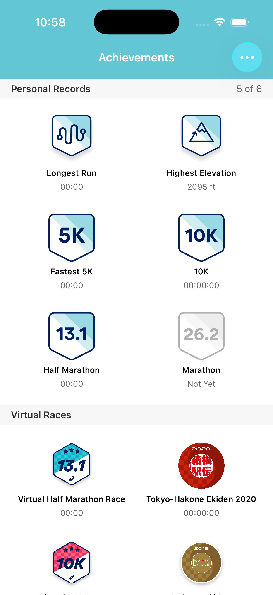
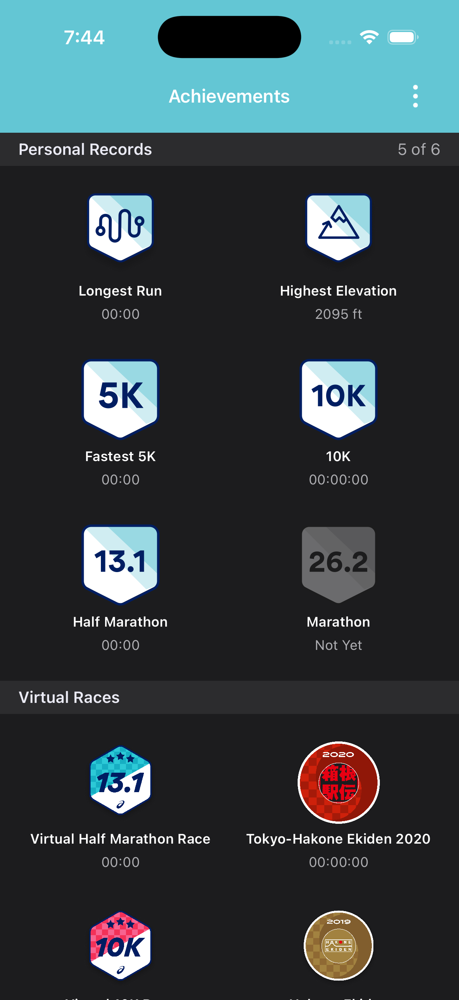
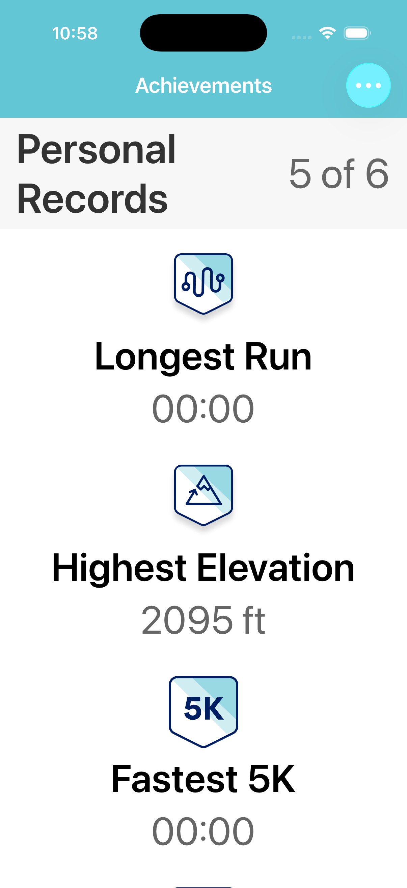
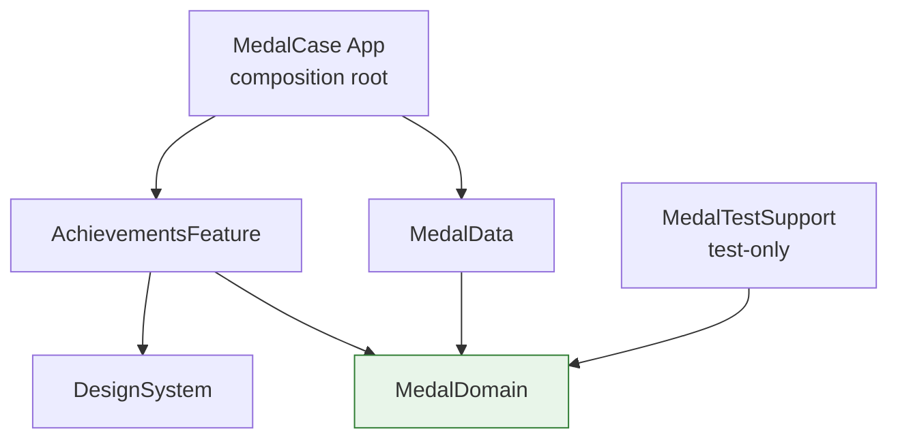

# MedalCase

A native **SwiftUI** rebuild of Runkeeper's **Achievements medal case** — a sectioned grid of earned
and locked medals — built through a documented, **spec-driven agentic pipeline that is itself part of
the deliverable**. The app is generated *from* [`tech_specs/`](tech_specs/) and kept coherent *with*
them; the [`.claude/`](.claude/) tooling, golden [`evals/`](evals/), and structured
[`telemetry/`](telemetry/) are committed as graded evidence.

> **Toolchain:** Swift 6 (Xcode 16+, developed on Xcode 26.6) · deployment **iOS 17** · strict
> concurrency `complete`. Open `MedalCase.xcodeproj` and Run (iPhone 17) — no setup tool required.

| Light (matches the mock) | Dark | Accessibility XXL |
|:---:|:---:|:---:|
|  |  |  |

The light render is a faithful match to the brief's mock: shield personal-record badges, the ghosted
"26.2 / Not Yet" Marathon, hexagonal Asics race medals, mock-exact value formats, the small centered
white "Achievements" on a teal bar — and a **data-driven "5 of 6"** (the mock's own annotated "4 of 6"
is unsatisfiable against its five colored cells — [ADR-0008](tech_specs/adr/0008-data-driven-counts.md)).

---

## What's here

- **Clean multi-package SPM architecture** — 5 local modules under [`Modules/`](Modules/) with an
  inward-pointing dependency rule **enforced by the package graph** (an illegal import won't compile);
  the App target is a thin composition root.
- **A data layer that resolves the brief's traps** — a self-defined, server-shaped contract with eight
  decode/mapping policies (forward-compatible: unknown medal types/values/statuses degrade instead of
  breaking), all unit-tested.
- **55 tests** — 47 package unit tests (Swift Testing) + 8 app-target tests (1 integration, 5 snapshot,
  2 XCUITest incl. a launch-perf metric); **CI green**, running the app tests on every PR.
- **Accessibility-audited** — each medal cell is one VoiceOver element, Dynamic Type to accessibility
  XXL with a 2→1 column reflow and no truncation, an honest WCAG contrast finding on the mock's own
  nav bar.
- **A measured performance story** — cold launch **0.79 s**, and a screen built for the "absence of
  work" that matters to a battery-conscious running app.
- **The agentic pipeline** — 8 skills, 5 tool-scoped subagents, an orchestrator, an LLM-as-judge eval
  suite that **discriminates** (an adversarial golden it correctly fails), evidence-gated git hooks,
  and generated run telemetry.

---

## The brief, point by point

| Requirement (from the assignment) | ✓ | Where |
|---|:--:|---|
| **Grid-view medal case** matching the mock | ✅ | `AchievementsView` (2-col `LazyVGrid`, 2 sections) |
| **Personal Records** + **Virtual Races** sections | ✅ | data-driven `AchievementSection` |
| Section **progress count** ("N of 6") | ✅ | computed `earnedCount/totalCount` ([ADR-0008](tech_specs/adr/0008-data-driven-counts.md)) |
| Each medal: **badge + title + value** | ✅ | `MedalCellView` |
| **Locked** medal (ghosted, "Not Yet") | ✅ | `GhostedMedal` modifier ([ADR-0007](tech_specs/adr/0007-locked-medal-rendering.md)) |
| **Vector assets used as vectors** | ✅ | 13 PDFs, Single Scale + Preserve Vector Data ([ADR-0006](tech_specs/adr/0006-vector-asset-pipeline.md)) |
| **Colors/fonts** per the annotated mock | ✅ | `SemanticColor` / `Typography` tokens (single source) |
| **Swift**, iPhone | ✅ | SwiftUI, iOS 17 |

**Beyond the brief:** dark mode; Dynamic Type XXL with column reflow; a functional overflow menu (toggles
the Marathon to show the count is live); an async repository seam ready for a real API; the full AI-DLC
pipeline with a discriminating eval suite.

---

## Points of discussion — the mock's landmines (found → decided → documented)

The brief says the project "will be used for points of discussion around technical choices." The mock
contains several deliberate (or sloppy) inconsistencies; each became an explicit, documented, tested
decision rather than a silent assumption. Full table: [`02-data-contract.md`](tech_specs/02-data-contract.md).

| # | Landmine | Decision |
|---|---|---|
| **L1** | Header annotated **"4 of 6"** but **5** cells render colored | The two facts are mutually unsatisfiable. **Visual states win**: the count is computed from data → "5 of 6", and the mock's contradiction is documented ([ADR-0008](tech_specs/adr/0008-data-driven-counts.md)) |
| **L2** | Value formats mix `00:00`, `00:00:00`, `23:07`, `2095 ft` | Typed `MedalValue` union + a data-carried duration *style* (not magnitude-inferred); one `MedalValueFormatter` renders mock-exact output ([ADR-0010](tech_specs/adr/0010-value-formatting.md)) |
| **L3** | No locked-variant asset for Marathon | Derived: `saturation(0)` + reduced opacity on the earned badge — one asset, both states ([ADR-0007](tech_specs/adr/0007-locked-medal-rendering.md)) |
| **L4** | 7 virtual-race assets supplied, 6 in the mock | Grid is data-driven; the unused asset ships in the catalog unreferenced — proof cells aren't hardcoded |
| **L5** | Asset filename chaos (`tokyo-hakone-ekiden-2020` vs snake_case; a `kakone` typo) | Normalized catalog keys; `asset_key` is the single mapping surface |
| **L6** | The 10K cell is titled just "10K" (not "Fastest 10K") | Titles render verbatim from data — mock-exact |
| **L7** | Back chevron + "⋮" on a single-screen app | Real chrome: a `NavigationStack` with a functional overflow demo menu |

---

## Architecture



Dependencies point **inward** toward the domain, and the arrows are enforced by the package graph
([ADR-0003](tech_specs/adr/0003-multi-package-spm.md)):

| Package | Role | Constraint |
|---|---|---|
| **MedalDomain** | value types, `MedalValueFormatter`, `AchievementsRepository` protocol, `MedalError` | pure Swift — **imports nothing**, not even Foundation (so it ports to Kotlin) |
| **MedalData** | DTOs, mapper (policies P1–P8), bundled repository | implements the domain protocol; only `DefaultAchievementsRepository` is public |
| **DesignSystem** | tokens (the mock's hexes/sizes), the medal asset catalog, components, `ViewState` | SwiftUI only — UIKit-free |
| **AchievementsFeature** | `@Observable` ViewModel + the grid/cell views | a leaf: domain + design system only, never `MedalData` |
| **App** | `RootView` composition root, teal nav styling | thin; the one place allowed to see concretes |

**Why an async repository with no networking stack.** `AchievementsRepository.achievements()` is
`async throws` because that is the *real* contract — Runkeeper's medal case is server-fed. Today the one
implementation reads a bundled fixture; a remote source would slot in behind the same protocol, touching
only `MedalData` + the composition root. No caching tiers, no HTTP client — this brief doesn't earn them
([ADR-0004](tech_specs/adr/0004-bundled-data-repository-seam.md)). This gives real loading/empty/error
code paths without speculative abstraction.

---

## Performance & battery — the Runkeeper lens

A running app is on the phone for hours; battery discipline is a feature. This screen is static, so the
strategy is the **absence of work** ([`performance-battery.md`](tech_specs/performance-battery.md)):

| Metric | Result | How |
|---|---|---|
| **Cold launch → first frame** | **0.79 s** (5 runs, RSD 1.3%) | `XCTApplicationLaunchMetric` (a signpost-backed metric) on iPhone 17 |
| Ongoing work after load | **none** | the ViewModel loads once via `.task`, then goes inert — no timers/polling/background tasks |
| Offscreen cells | lazy | `LazyVStack` + `LazyVGrid` by construction |
| Badge decode | once, at display size | asset catalog + fixed cell frame; no runtime PDF re-rasterization |

*Honest scope:* the launch number is a real metric; the scroll-hitch/allocations claims are verified by
construction + code review, not yet from the Instruments GUI templates (named in the roadmap). **How this
scales to live tracking** (interview notes, not scope): GPS duty-cycling, `HKWorkoutSession`, batched
disk writes, coalesced background-`URLSession` uploads, offline-first sync — the medal case needs none of
these, and knowing *why not* is the point.

---

## Testing

**55 tests**, at the cheapest boundary that proves each thing ([ADR-0009](tech_specs/adr/0009-testing-strategy.md)):

| Layer | Count | Tool | Runs in CI |
|---|:--:|---|:--:|
| MedalDomain (formatter matrix, counts, seam) | 16 | Swift Testing | ✅ |
| MedalData (decode + policies P1–P8 + repository) | 16 | Swift Testing | ✅ |
| AchievementsFeature (ViewModel state machine, a11y labels, progress) | 11 | Swift Testing | ✅ |
| DesignSystem (asset resolution) | 4 | Swift Testing | ✅ |
| App integration (real repository → ViewModel → 5-of-6) | 1 | Swift Testing | ✅ |
| Component snapshots (cell light/dark, locked, header) | 5 | swift-snapshot-testing | local + pre-push ([ADR-0009](tech_specs/adr/0009-testing-strategy.md)) |
| XCUITest smoke + launch-perf | 2 | XCUITest | ✅ |

Mocks + fixtures live in a dedicated `MedalTestSupport` package (never inlined); `MedalDomain` uses a
*local* double to avoid a package cycle. Run: `swift test --package-path Modules/<Name>` (fast loop) or
`xcodebuild test -scheme MedalCase -destination 'platform=iOS Simulator,name=iPhone 17'`.

---

## Accessibility

A default, not a pass ([`accessibility.md`](tech_specs/accessibility.md)):

- **VoiceOver:** each medal cell is **one** element — "Highest Elevation, 2095 ft" / "Marathon, not yet
  earned" (asserted by an XCUITest); section headers carry the heading trait.
- **Dynamic Type** to accessibility XXL: the mock's exact point sizes scale (`@ScaledMetric` tokens), the
  grid **reflows 2→1 column**, and long titles ("Tokyo-Hakone Ekiden 2020") wrap without truncation.
- **Dark mode** via adaptive tokens.
- **An honest contrast finding:** the mock's own nav bar (white on teal `#63C6D4`) computes to **2.0:1 —
  below WCAG AA**. Kept for mock fidelity by default, with an Increased-Contrast path that swaps to a
  darkened teal clearing 4.5:1. Documented, not silently claimed compliant.

---

## The AI-DLC pipeline

Built *through* a committed pipeline, not just *with* an assistant. Phases: **Govern → Specify →
Decompose → Construct → Verify → Document.** Specs are authoritative; code is generated from them and kept
coherent with them.

- **8 skills** ([`.claude/skills/`](.claude/skills/)) — versioned prompt templates, each with a typed
  I/O contract (`/spec`, `/scaffold-module`, `/tdd`, `/ios-review`, `/pre-commit-review`, `/eval`,
  `/visual-eval`, `/sync-readme`).
- **5 tool-scoped subagents** ([`.claude/agents/`](.claude/agents/)) — the reviewer is **read-only** (it
  cannot edit the code it judges) and the test-author is separate from the builders (genuine red/green
  separation).
- **An orchestrator** ([`build-modules.mjs`](.claude/workflows/build-modules.mjs)) — tiered parallel
  fan-out with a structured-verdict-gated repair loop.
- **Evidence-gated git hooks** — `/pre-commit-review` and `/ios-review` evidence is content-addressed
  (staged-diff hash / HEAD sha), so it auto-expires the instant the code changes — a freshness
  guarantee, not an honor system.

### Run telemetry (generated from [`telemetry/runs.jsonl`](telemetry/runs.jsonl))

Every skill/agent run appends a structured line; this table is generated, not hand-curated. **35 logged
runs (32 skill/agent below + 3 milestone markers), 33 PASS, 2 FAIL→repaired** — the two failures are the
point:

| Skill / agent | Runs | Verdicts |
|---|:--:|---|
| `swift-reviewer` (adversarial review) | 7 | **5 PASS, 2 FAIL → repaired** |
| `/ios-review` (push gate) | 7 | 7 PASS |
| `/pre-commit-review` (commit gate) | 7 | 7 PASS |
| `test-author` / `swiftui-component-builder` / `swift-module-builder` | 8 | 8 PASS |
| `/spec`, `/eval` | 3 | 3 PASS |

The independent reviewer **genuinely failed two of its passes** and they were repaired before merge: in
M3 it caught that `MedalAsset`'s public surface had drifted from its contract, leaving policy P5
untested; in M6 it caught stale spec lines contradicting deleted code. That is the difference between "I
have a review step" and "my review step has teeth."

### Evals — measurable, not vibes

[`evals/`](evals/): golden set → weighted LLM-as-judge rubric → draft-07 schema → thresholds. It
**discriminates**: alongside a clean `MedalDomain` golden (1.00 PASS), an **adversarial** golden
describing a dependency-rule cycle + force-try is correctly **failed at 0.375** with its blocker criteria
at 0. Every recorded aggregate equals Σ(weight×score) (script-verified). The visual suite judges the real
screenshots above (advisory — [ADR-0009](tech_specs/adr/0009-testing-strategy.md)).

---

## The role, mapped

Deliberate evidence for the Runkeeper Mobile Developer JD ([`docs/EXECUTION_PLAN.md`](docs/EXECUTION_PLAN.md) §8):

| JD signal | Evidence |
|---|---|
| "Document technical decisions and approaches" | 10 ADRs + EARS specs, written *before* code |
| Code reviews / PR discipline | evidence-gated review pipeline; one reviewable PR per milestone (M0–M8) |
| "Minimal tech debt … quality standards" | the constitution + `swiftlint --strict` + zero force-unwraps + spec↔code gate |
| Release ownership / crash monitoring | error taxonomy with no silent failures; MetricKit/crash seam named; shared scheme + CI |
| "Write user stories for the backlog" | EARS requirements with Given/When/Then — Jira-story-shaped |
| Pods / cross-pod conflict awareness | package-per-concern boundaries map to pod ownership |
| "Keep current on new tech that reduces friction" | the AI-DLC pipeline itself |

---

## Setup

```bash
git clone https://github.com/ismailgok33/MedalCase-iOS && cd MedalCase-iOS
git config core.hooksPath .githooks     # enable the review gates (once per clone)
open MedalCase.xcodeproj                 # select the MedalCase scheme → Run (iPhone 17)
```

- **Runtime dependencies:** none (pure SwiftUI + Foundation). Test-only: `swift-snapshot-testing`.
- **No project-generation step needed** — `MedalCase.xcodeproj` is committed
  ([ADR-0001](tech_specs/adr/0001-xcodegen-project-generation.md)). To regenerate after structural
  changes: `brew install xcodegen && xcodegen generate` (source of truth: [`project.yml`](project.yml)).

---

## If I had more time

- **Remote data source** behind the existing `AchievementsDataSource` seam (+ `/security-review` gate the
  day it lands) — the architecture is already shaped for it.
- **The Instruments GUI pass** — Time Profiler / SwiftUI / Allocations templates to put scroll-hitch and
  memory numbers behind the rule-8 claims (launch time is already measured).
- **Localization** — EN + JA String Catalogs (strings are already catalog-ready via `LocalizedStringKey`/
  `LocalizedStringResource`); the fixture already carries CJK race names.
- **A typed MCP payload validator** for the achievements contract (structured errors, never-throws) — the
  JD's "typed I/O schema" requirement, sketched in the plan.
- **Grow the golden set** — more good *and* adversarial cases per skill; pin the judge model + temperature
  0 + multi-sample voting for determinism.
- **Medal detail / share sheet** — tap a medal for its story; promote the visual eval from advisory once
  calibrated.

---

*Built with a spec-driven AI-DLC workflow. Total: 5 packages · 55 tests · 10 ADRs · 8 milestones, one PR
each. The pipeline is committed as evidence — see [`docs/EXECUTION_PLAN.md`](docs/EXECUTION_PLAN.md) for
the full roadmap.*
